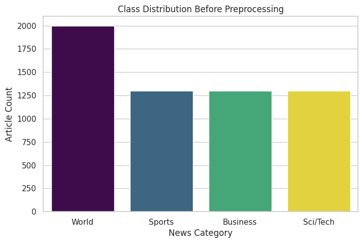
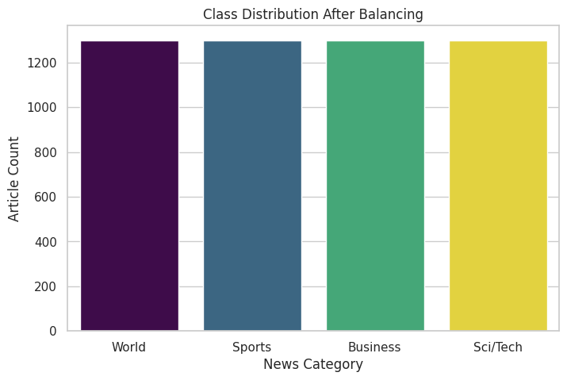
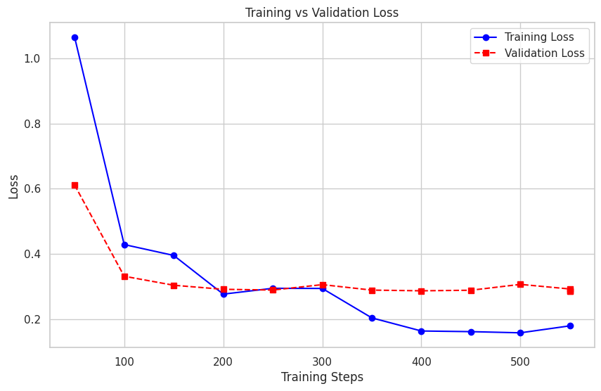

# News Topic Classifier Using BERT

## 📌 Objective
The primary goal of this project is to fine-tune a pre-trained transformer model (`bert-base-uncased`) to accurately classify news headlines and articles into four distinct topic categories: World, Sports, Business, and Sci/Tech.

## 📊 Dataset & Preprocessing
**Source:** AG News Dataset (via Hugging Face)

**1. Original Data Distribution:**
Before processing, the raw dataset was highly imbalanced and biased heavily toward the "World" news category. Training on this would have caused the model to over-predict that specific class.

**2. Balancing the Dataset:**
To fix this bias, an undersampling technique was applied. The script identified the minimum class count and randomly sampled exactly that amount from the other categories so all four classes had the exact same number of articles.

**3. Tokenization:** The balanced text data was tokenized using the BERT tokenizer with a strict maximum length cutoff of 128 tokens to optimize memory usage and processing speed.

## 🧠 Methodology & Approach
* **Model Architecture:** `bert-base-uncased` configured for sequence classification with 4 output labels.
* **Training Framework:** Hugging Face `Trainer` API.
* **Optimization:**
  * **Learning Rate:** `2e-5`
  * **Weight Decay:** `0.01`
* **Deployment:** Built a real-time, interactive web application using **Gradio** to allow live user testing of the fine-tuned model.

## 📉 Overfitting Check & Early Stopping
To ensure the model generalized well to unseen data rather than just memorizing the training set, an `EarlyStoppingCallback` was implemented with a patience of 3 evaluation steps. 

We validated the model's health by plotting the **Training vs. Validation Loss**. The model achieved optimal convergence, and the early stopping mechanism autonomously halted training shortly after the validation loss plateaued, discarding the overfitted epochs and reverting to the best weights.

## 📈 Key Results
At the optimal checkpoint, the model achieved the following metrics:
* **Final Accuracy:** 91.62%
* **Final F1-Score:** 91.63%
* **Live Testing:** The model demonstrated exceptional confidence scores (92% - 98%) when tested with unseen, real-world news snippets via the Gradio interface.

## 📦 Model Access
Due to GitHub's file size constraints, the fine-tuned model weights (`model.safetensors`) and tokenizer configurations are hosted externally on Google Drive. 
* **Access the trained model here:** [AG_News_BERT_Model Folder](https://drive.google.com/drive/folders/1Dgv5B2pPngT5xY6tRLfrcQI0vZD0coDT?usp=sharing)

## 🛠️ Tech Stack
* **Language:** Python
* **Libraries:** Transformers, Datasets, PyTorch, Scikit-Learn, Evaluate, Gradio, Pandas, Matplotlib

## 👩‍💻 Author
**Eshaal Hammad**
* **Email:** eshaalhammad234@gmail.com
